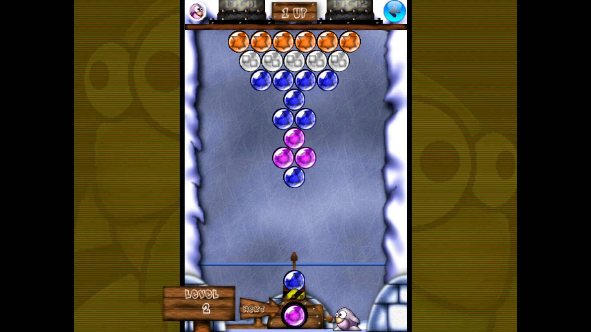

# Frozen Bubble — OUYA port: technical notes

This document describes everything that was changed to bring the official
Android version of Frozen Bubble to the **OUYA** microconsole. The aim was
a clean, minimal diff on top of upstream
[videogameboy76/frozenbubbleandroid](https://github.com/videogameboy76/frozenbubbleandroid)
(branch `android_studio`).



## Why this base, not the Linux build

Frozen Bubble has several incarnations:

- The **original** game (frozen-bubble.org) — Perl + SDL with a small C
  library. The multiplayer modes everyone remembers live here, but Perl on
  Android is not realistic.
- The **official Android port** — pure **Java** game logic with a small
  native audio library, already running on Android and already shipping the
  full multiplayer feature set (LAN, internet, Bluetooth, and two players
  on one device).

The Android port is therefore the natural base: no engine porting, no
OpenGL/SDL translation layer, and the multiplayer is already implemented.

## Target platform

| | |
| --- | --- |
| Device | OUYA (NVIDIA Tegra 3) |
| OS | Android 4.1, **API 16** |
| ABI | **armeabi-v7a** only |
| Rendering | Android `Canvas` 2D (`SurfaceHolder.lockCanvas`) — no OpenGL |

Because the game renders with the 2D `Canvas` API, there was no GLES /
shader work at all — a major contrast with our SDL/OpenGL console ports.

## Build configuration changes

`frozenbubble/build.gradle`:

- `ndkVersion` `27.0.12077973` → **`23.2.8568313`** (the NDK we build with).
- `compileSdk` / `targetSdk` `35` → **`34`** (platform 34 is installed;
  avoids an SDK auto-download).
- `minSdkVersion` `14` → **`16`** (OUYA).
- Added `ndk { abiFilters "armeabi-v7a" }` so only the OUYA ABI is built and
  packaged.
- Added a `signingConfigs.release` block that reads `keystore.properties`
  (kept out of version control) and explicitly enables **APK signature
  scheme v1** — required because the OUYA runs API 16 (scheme v2 only
  arrived in API 24).

`frozenbubble/src/main/jni/Application.mk`:

- `APP_ABI` → **`armeabi-v7a`**.
- `APP_PLATFORM` `android-21` → **`android-16`**. This is important: the
  native `libmodplug` was previously built against API 21, so it would
  **fail to load** on the OUYA's API 16. Rebuilding against android-16 fixes
  that. Verified on-device:
  `I/JNI_STUBS: Initializing modplug with rate 44100`.
- Removed the NDK-r27-only `APP_SUPPORT_FLEXIBLE_PAGE_SIZES` flag.

Toolchain: **JDK 17** (AGP 8.4.2 requires it), Gradle 8.6.

## Manifest changes (`AndroidManifest.xml`)

- Added the OUYA + Android-TV launcher categories to the `HomeScreen`
  activity's intent filter:

  ```xml
  <category android:name="android.intent.category.LEANBACK_LAUNCHER"/>
  <category android:name="tv.ouya.intent.category.GAME"/>
  ```

- Forced **landscape** orientation on both `HomeScreen` and `FrozenBubble`.
  The game ships landscape layouts (the 2-player mode is landscape), so the
  portrait single-player field is rendered centred with the decorative
  background filling the sides — full-screen and correct on a TV.
- Added `assets/ouya_icon.png` (732 × 412), the icon the OUYA launcher
  shows in the Games menu.

## Controller mapping

This is the bulk of the port. The OUYA controller has **no Start, Back or
Menu key**, and its face buttons emit `KEYCODE_BUTTON_*` events that
standard Android widgets (menu buttons, dialogs, the options menu) do **not**
treat as navigation keys. Out of the box you could navigate menus with the
D-pad but not *activate* anything, and you could not reach the in-game menu.

### Shared translation helper

`com/efortin/frozenbubble/OuyaInput.java` (new) rewrites controller buttons
into the navigation keys the rest of the app already understands:

| OUYA button | Translated to | Effect |
| --- | --- | --- |
| **O** (`BUTTON_A`) | `DPAD_CENTER` | confirm in menus, fire in game |
| **A** (`BUTTON_B`) | `BACK` | cancel in menus, exit dialog in game |

It is applied in each activity's `dispatchKeyEvent()` so the rewritten event
reaches the focused widget. Crucially, the rewrite **preserves the original
`deviceId`** (using the full `KeyEvent` constructor) — without that, the
engine could no longer tell two controllers apart and local 2-player input
would break.

Both `HomeScreen` and `FrozenBubble` override:

```java
@Override
public boolean dispatchKeyEvent(KeyEvent event) {
  return super.dispatchKeyEvent(OuyaInput.translate(event));
}
```

### In-game extras

`GameView.java`:

- `mapGameControllerKeyCode()` (new, called from `onKeyDown`) adds:
  **U** (`BUTTON_X`) → swap (`DPAD_DOWN`); **L1/L2** → aim left; **R1/R2** →
  aim right.
- `onGenericMotionEvent()` was extended to read the **left analog stick**
  (`AXIS_X` / `AXIS_Y`, deadzone 0.35) in addition to the existing D-pad
  hat, falling back to the stick only when the hat is centred. This gives
  analog aiming on top of the discrete D-pad.

`FrozenBubble.java`:

- `onKeyDown()` maps **Y** (`BUTTON_Y`) → `openOptionsMenu()`, since the
  OUYA has no Menu key and the in-game menu (new game, sound options, target
  mode, colour-blind mode, …) would otherwise be unreachable.

### Final mapping

| Action | OUYA controller |
| --- | --- |
| Aim | D-pad ◀ ▶ · left analog stick · L1 / R1 |
| Fire | **O** |
| Swap | **U** · D-pad ▼ |
| Confirm | **O** |
| Cancel / back / exit | **A** |
| Options menu | **Y** |

## On-device verification

Installed and launched on a real OUYA (armeabi-v7a, API 16) over Wi-Fi adb:

- App starts, `HomeScreen` displayed in ~0.5 s.
- `libmodplug-1.0.so` loads and the MOD player initialises (native audio
  works on real hardware).
- Gameplay renders full-screen in landscape (see screenshot above).
- No crashes, no error-level log output.

### Still to validate with a physical controller

`adb` can only inject D-pad key events (which work), not real gamepad
button events with a device ID. The following are implemented but want
hands-on confirmation: the O/A/U/Y face buttons and analog-stick aiming,
the Y → options menu, the A → exit dialog, and the two headline multiplayer
paths — **two controllers on one OUYA** and **LAN play between consoles**.

## Files changed

```
frozenbubble/build.gradle                     # NDK/SDK/ABI/min-sdk + release signing
frozenbubble/src/main/AndroidManifest.xml     # OUYA category, landscape, icon
frozenbubble/src/main/jni/Application.mk       # armv7 + API16 native build
frozenbubble/src/main/assets/ouya_icon.png    # new — launcher icon (732x412)
frozenbubble/src/main/java/com/efortin/frozenbubble/OuyaInput.java   # new — key translation
frozenbubble/src/main/java/com/efortin/frozenbubble/HomeScreen.java  # dispatchKeyEvent
frozenbubble/src/main/java/org/jfedor/frozenbubble/FrozenBubble.java # dispatchKeyEvent + Y menu
frozenbubble/src/main/java/org/jfedor/frozenbubble/GameView.java     # buttons + analog aim
```
